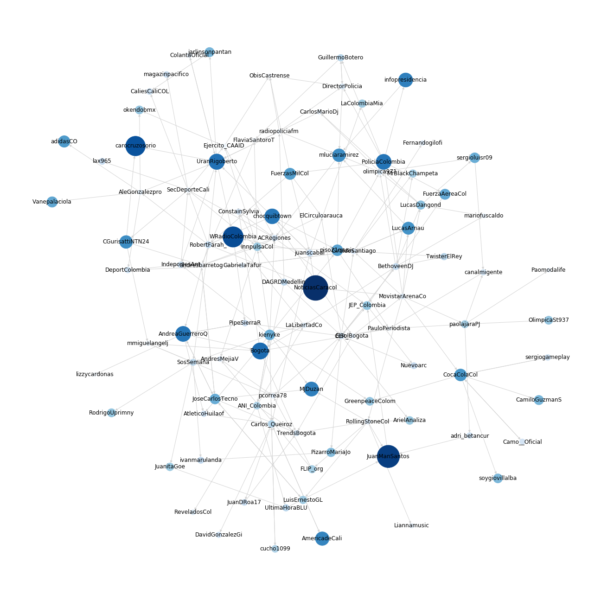

# Twitter User Network
Scripts for creating a directed network of Twitter followers.

These scripts work in three parts.

1. Taking an initial user, download information about who they follow. Repeat recursively until depth *d*.
2. Generate the files `edges.csv` and `vertices.csv` required to create the directed graph.
3. Create and visualize the network.

## Requirements
* Tweepy
* NetworkX
* Jupyter Notebooks

## Usage

### Extract The Information
* Choose the Twitter user where the program will start e.g. `@NoticiasCaracol`.
* Decide what recursive depth you want to go.  A depth of 1 or 2 should be done in a few hours (depending on how many people they are following), a depth of 5 can take several days.

`python GetFollowing.py -s NoticiasCaracol -d 2`

This will generate a directory structure like
```
.
├── following
│   ├── NoticiasCaracol.csv
│   └── Bogota.csv
└── twitter-users
    ├── 17813487.json
    └── 57664761.json
```

The `following` directory contains a file for every Twitter user name searched. Each file is a `.csv` file showing who they are following.

The `twitter-users` directory contains a `.json` representation of every user. The file name is their Twitter ID.

### Generate The Network Files

This script parses the `.csv` files and creates two new `.csv` which contains the elements of the network.

    python GenerateNetwork.py -s NoticiasCaracol
    
The file `edges.csv` contains the network's edges delimited by commas:

```
source,target
17813487,57664761
```

Column 1 is the Twitter ID of a User. Column 2 is the ID of a User they follow.

The file `vertices.csv` contains the network's vertices delimited by commas:

```
id,screen_name,followers,friends
17813487,NoticiasCaracol,8321076,1287
```

Column 1 is the Twitter ID. Column 2 is the screen name. Column 3 has the number of followers of the user. Column 4 has the number of users followed by this user.


### Create and visualize the network.

Run jupyter notebooks with the command:

    jupyter notebook
    
Open the `Graph.ipynb` notebook and run it.

